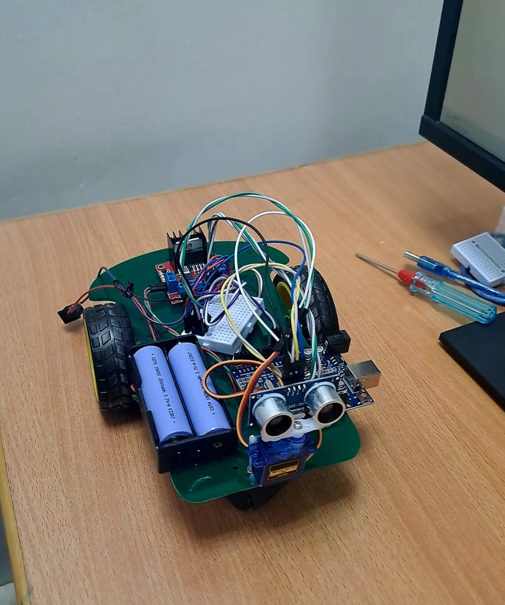

# 🤖 Autonomous Obstacle Avoidance Robot

An Arduino-powered 4-wheel robot that drives autonomously and avoids obstacles in real time using an ultrasonic distance sensor mounted on a servo "scanner." When it detects an obstacle ahead, it stops, reverses slightly, scans left and right to find the clearer path, and turns accordingly — all without any human input.

## Project Photo

*The physical build: 4WD chassis, L298N motor driver, HC-SR04 ultrasonic sensor on an SG90 servo, and dual 18650 Li-ion battery pack.*

## 🎥 Demo

##  Features

- **Real-time obstacle detection** using an HC-SR04 ultrasonic sensor
- **Smart directional scanning** — sweeps left and right via a servo motor to decide the best turn direction
- **Autonomous navigation** with no remote control or external computer required
- **Simple, low-cost hardware** — built entirely on an Arduino-compatible board with common hobbyist components
- **Serial debugging output** for live distance readings during operation

##  How It Works

1. The robot drives forward continuously while polling the ultrasonic sensor for the distance to the nearest object ahead.
2. If an obstacle is detected within **20 cm**, the robot:
   - Stops
   - Reverses briefly to create scanning room
   - Sweeps the servo-mounted sensor to look **left**, then **right**, recording the distance at each side
   - Compares the two readings and turns toward whichever side has more open space
   - Recenters the sensor and resumes forward motion
3. This loop runs continuously, allowing the robot to navigate around obstacles without any manual intervention.

##  Hardware Components

| Component | Purpose |
|---|---|
| Arduino Uno (or compatible) | Main microcontroller |
| L298N Motor Driver Module | Drives the two DC gear motors |
| HC-SR04 Ultrasonic Sensor | Measures distance to obstacles |
| SG90 Micro Servo | Rotates the ultrasonic sensor to scan left/right |
| 4WD Robot Chassis + DC Motors | Drivetrain |
| 2x 18650 Li-ion Batteries + Holder | Power source |
| Breadboard + Jumper Wires | Circuit connections |

##  Pin Configuration

| Function | Arduino Pin |
|---|---|
| Ultrasonic Trig | 3 |
| Ultrasonic Echo | 6 |
| Servo Signal | 7 |
| Motor Driver Input 1 (T4) | 8 |
| Motor Driver Input 2 (T3) | 9 |
| Motor Driver Input 3 (T2) | 10 |
| Motor Driver Input 4 (T1) | 11 |

> Adjust these values in the code if your wiring differs.

## 🚀 Getting Started

### Prerequisites
- [Arduino IDE](https://www.arduino.cc/en/software) installed
- The **Servo** library (comes pre-installed with the Arduino IDE)

### Setup
1. Assemble the hardware according to the pin configuration table above.
2. Connect your Arduino board to your computer via USB.
3. Open `AutonomousObstacleAvoidanceRobot.ino` in the Arduino IDE.
4. Select the correct **Board** and **Port** under the `Tools` menu.
5. Click **Upload**.
6. Once powered, place the robot on the floor and power it on — it will begin driving and avoiding obstacles automatically.

### Tuning
- **Obstacle trigger distance**: change the `20` (cm) threshold in the `if (frontDistance < 20)` condition to make the robot more or less cautious.
- **Turn/reverse durations**: adjust the `delay()` values in `loop()` to change how sharply or how long the robot turns/reverses.

## 🔭 Future Improvements

- Add a Bluetooth/Wi-Fi module for optional manual override
- Replace fixed-time turns with encoder-based precise turning
- Add a battery voltage indicator (LED or OLED display)
- Log distance data for path-mapping experiments

## 📄 License

This project is open-source and available for personal and educational use.
